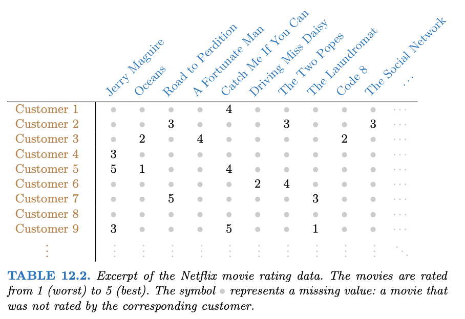

```{r startup, include = FALSE, message = FALSE, warning = FALSE}
knitr::opts_chunk$set(echo = T, 
                      eval=T, 
                      message=F, 
                      warning=F, 
                      error=F, 
                      comment=NA)
```

# Outline

* `USArrests` data, discusso in [An Introduction to Statistical Learning](https://hastie.su.domains/ISLR2/ISLRv2_website.pdf), Sezione 12.2 e 12.5.1

* Valori mancanti e completamento della matrice, discusso in [An Introduction to Statistical Learning](https://hastie.su.domains/ISLR2/ISLRv2_website.pdf), Sezione 12.3 e 12.5.2

* `heptathlon` data, discusso in An introduction to Applied Multivariate Analysis with R, Sezione 3.10.2

---

# `USArrests`

Per ciascuno dei $n=50$ stati negli Stati Uniti, il data set contiene il numero degli arresti
per 100.000 residenti per ciascuno dei tre reati: 

* aggressione (`Assault`)
* omicidio (`Murder`)
* stupro (`Rape`)

E' inoltre presente la variabile `UrbanPop`, che indica la percentuale della popolazione in ogni stato che vive nelle aree urbane

---

```{r}
X <- USArrests
n <- nrow(X)
p <- ncol(X)
states <- row.names(X)
names(X)
head(X)
```

---

```{r}
apply(X, 2, mean)
apply(X, 2, var) * (n-1)/n
```

Se non standardizziamo le  variabili prima di eseguire la PCA, le componenti principali saranno influenzate dalla variabile `Assault` che presenta variabilità molto elevata. 

Per questi dati è importante standardizzare i
dati prima di eseguire PCA.

---

```{r}
devstd <- sqrt( apply(X, 2, var) * (n-1)/n )
Z <- scale(X, center=TRUE, scale = devstd)
R <- cor(X)
R
```

---

```{r}
eigenR <- eigen(R)
Lambda <- diag(eigenR$values)
Lambda
# pesi
V <- eigenR$vectors
V
# punteggi
Y <- Z %*% V
head(Y)
```

---

# `princomp()`

```{r}
# cor = TRUE per PCA su dati standardizzati
ACP <- princomp(X, cor=TRUE)
names(ACP)
```

---

```{r}
# Standard deviation coincide con sqrt(diag(Lambda))
summary(ACP) 
# pesi
ACP$loadings[,]
# punteggi
ACP$scores
```

---

# `prcomp()`

```{r}
ACP2 <- prcomp(X, scale=TRUE)
names(ACP2)
# le deviazioni standard sono calcolate con il denominatore n-1 
ACP2$scale
devstd * sqrt(n/(n-1))
```

---

```{r}
# Standard deviation coincide con sqrt(diag(Lambda) * n/(n-1) )
summary(ACP2) 
# pesi
ACP2$rotation[,]
# punteggi
ACP2$x
```

---

```{r}
biplot(ACP , scale = 0)
```

---

Possiamo notare che i pesi della prima componente sono approssimativamente
uguali per `Assault`, `Murder` e `Rape`, ma inferiore per `UrbanPop`. Questa componente corrisponde approssimativamente a una misura complessiva di tassi di reati gravi. 

Il secondo vettore dei pesi pone la maggior parte del suo peso
su `UrbanPop` e molto meno peso sulle altre tre variabili. Questa
componente corrisponde grosso modo al livello di urbanizzazione dello stato.

Nella figura prececente, vediamo che le variabili relative alla criminalità 
si trovano vicine, mentre la variabile UrbanPop è lontana. 
Ciò indica che le variabili relative alla criminalità sono correlate
tra loro, e che la variabile `UrbanPop` è meno correlata con le altre.

La figura suggerisce che gli stati con  punteggi positivi sulla prima componente, come California, Nevada e Florida, hanno alti tassi di criminalità, mentre
Stati come il North Dakota, con punteggi negativi sulla prima componente, hanno bassi tassi di criminalità. La California ha anche un punteggio basso sulla secondo componente,
indica un alto livello di urbanizzazione, mentre è vero il contrario per gli stati
come il Mississippi. Stati vicini allo zero su entrambe le componenti, come Indiana,
hanno livelli approssimativamente medi sia di criminalità che di urbanizzazione.

---

# Correlazione tra componenti principali e variabili

Qual è la variabile (`Assault`, `Murder`, `Rape`, `UrbanPop`) più correlata (in valore assoluto) con la prima componente principale?

```{r}
k = 1 # prima componente principale
sapply(1:4, function(j) V[j,k]*sqrt(diag(Lambda)[k]) )
# corrisponde a 
cor(Y[,k], X)
```

---

# Teorema di Eckart-Young

La soluzione di 
$$\min_{A \in \mathbb{R}^{n\times q}, B \in \mathbb{R}^{p\times q} }\Big\{ \sum_{i=1}^{n}\sum_{j=1}^{p}(z_{ij} - \sum_{k=1}^{q} a_{ik} b_{jk} )^2 \Big\}$$
è data da $A = Y_q$ e $B = V_q$, quindi
$z_{ij} \approx \sum_{k=1}^{q} y_{ik} v_{jk} = \{Y_q V_q'\}_{ij}$

```{r}
q = 2
Yq = Y[,1:q, drop=FALSE]
Vq = V[,1:q, drop=FALSE]
Zapp = Yq %*% t(Vq)
sum(c(Z - Zapp)^2)
# corrisponde a 
n * sum(diag(Lambda)[(q+1):p])
```
---

# Analisi sui dati non standardizzati

.pull-left[
```{r}
plot(UrbanPop ~ Assault, X, asp=1)
```
]


.pull-right[
```{r}
biplot(princomp(X), scale=0)
```
]

---

# Valori mancanti e completamento della matrice

Spesso i set di dati presentano valori mancanti. Per esempio,
supponiamo di voler analizzare i dati di `USArrests` e scoprire che 20
dei 200 valori sono stati rimossi casualmente e contrassegnati come mancanti.

```{r}
nomit <- 20
set.seed(123)
ina <- sample(seq(n), nomit)
inb <- sample(1:p, nomit, replace = TRUE)
Zna <- Z
index.na <- cbind(ina, inb)
Zna[index.na] <- NA
```

Sfortunatamente, l'analisi delle componenti principali non prevede valori mancanti. Come dobbiamo procedere?

---

Possiamo risolvere 
$$\min_{A \in \mathbb{R}^{n\times q}, B \in \mathbb{R}^{p\times q} }\Big\{ \sum_{(i,j) \in \mathcal{O}}(z_{ij} - \sum_{k=1}^{q} a_{ik} b_{jk} )^2 \Big\}$$
dove $\mathcal{O}$ è l'insieme delle coppie di indici $(i,j)$ osservati. 

Una volta trovate le soluzioni $A^*$ e $B^*$, possiamo

* sostituire le osservazioni mancanti $z_{ij}$ con $z^*_{ij} = \sum_{k=1}^{q}a^*_{ik} b^*_{jk}$

* calcolare le $q$ componenti principali sui dati completi

La soluzione del problema di minimo è più complicata rispetto al caso di dati completi, ma è possibile utilizzare il seguente algoritmo iterativo (denominato *hard impute*)

---

**Algoritmo iterativo**

1. Per una matrice incompleta di dati $X$, costruire la matrice $\hat{X}$ con elementi
$$\hat{x}_{ij} = \left\{\begin{array}{cc}
x_{ij} & (i,j) \in \mathcal{O} \\
\bar{x}_{j} & (i,j) \notin \mathcal{O} \\
\end{array}\right.$$
dove $\bar{x}_{j}$ è il valore medio della $j$-sima variabile.

2. Ripetere i passi a.-c. fino a convergenza:

    a. risolvere
$$\min_{A \in \mathbb{R}^{n\times q}, B \in \mathbb{R}^{p\times q} }\Big\{ \sum_{i=1}^{n}\sum_{j=1}^{p}(\hat{x}_{ij} - \sum_{k=1}^{q} a_{ik} b_{jk} )^2 \Big\}$$
    b. Per ogni elemento $(i,j)\notin\mathcal{O}$, $\hat{x}_{ij} \leftarrow \sum_{k=1}^{q} a^*_{ik} b^*_{jk}$

    c. Calcolare 
$$e = \sum_{(i,j) \in \mathcal{O}}(\hat{x}_{ij} - \sum_{k=1}^{q} a^*_{ik} b^*_{jk} )^2$$

---

```{r}
Zhat <- Zna
zbar <- colMeans(Zna, na.rm = TRUE)
Zhat[index.na] <- zbar[inb]
ismiss <- is.na(Zna)

fit.svd <- function(X, q = 1){
  DVS <- svd(X)
  with(DVS, 
       u[,1:q, drop = FALSE] %*%
       (d[1:q] * t(v[,1:q, drop = FALSE]))
  )
}
```


---

```{r}
cor(Zhat[ismiss], Z[ismiss])
plot(Zhat[ismiss], Z[ismiss], asp=1)
abline(a=0,b=1)
```

---

```{r}
n_iter <- 10 # numero di iterazioni
for (iter in 1:n_iter){
  # Step 2.a
  Zapp <- fit.svd(Zhat, q = 1)
  # Step 2.b
  Zhat[ismiss] <- Zapp[ismiss]
  # Step 2.c
  e <- mean(((Zna - Zapp)[!ismiss])^2)
  cat("Iter :", iter, " Errore :", e, "\n")
}
```

---

```{r}
cor(Zhat[ismiss], Z[ismiss])
plot(Zhat[ismiss], Z[ismiss], asp=1)
abline(a=0,b=1)
```

---


---

# `heptathlon`

Caricare il dataset `heptathlon` presente nella libreria `HSAUR` (installarla se non presente nelle librerie disponibili). 

1. Esplorare i dati con sintesi grafiche e numeriche appropriate

2. Ricodificare tutte le 7 gare (`hurdles`,  `highjump`, `shot`, `run200m`, `longjump`, `javelin`, `run800m`) nella stessa direzione in modo che i valori "grandi"
sono indicativi di una prestazione "migliore"

3. Calcolare la matrice di correlazione tra le 7 gare (utilizzando le variabili ricodificate come specificato in 2.). Commentare il risultato. 

4. Costruire la matrice di diagrammi di dispersione ed individuare l'osservazione anomala (*outlier*). Rimuovere l'osservazione anomala dai dati e ricalcolare la matrice di correlazione, commentando il risultato.

5. Calcolare le componenti principali e determinarne il numero utilizzando uno o più criteri appropriati. Costruire il *biplot* e interpretare le prime due componenti principali.

6. Calcolare la correlazione (in valore assoluto) tra il vettore dei punteggi della prima componente principale e la variabile `score`, e  commentare.
